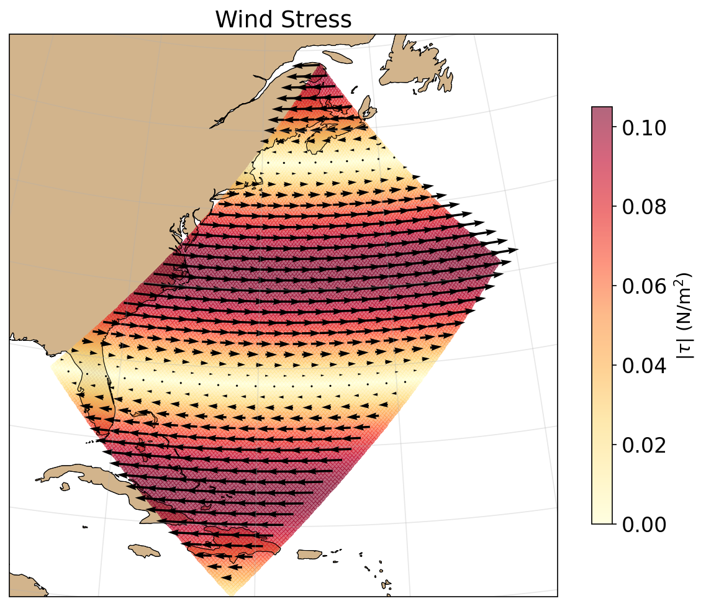

# NEMO GYRE

Dockerized [NEMO](https://www.nemo-ocean.eu/) ocean model running the
GYRE configuration — an idealized double-gyre basin on a beta-plane.

| SSH Variance | Mean SST | Surface Currents |
|:---:|:---:|:---:|
| [](analysis/ssh.ipynb) | [](analysis/sst.ipynb) | [](analysis/circulation.ipynb) |

| Surface KE | Heat Flux | Wind Stress |
|:---:|:---:|:---:|
| [](analysis/circulation.ipynb) | [](analysis/heat_salt.ipynb) | [](analysis/forcing_ke.ipynb) |

## Prerequisites

- Docker
- [Pixi](https://pixi.sh/) (for Python analysis)

## Quick start

```bash
make all        # build → run → analyze
```

Individual targets:

```bash
make build      # build Docker image with compiled NEMO
make run        # run 2-year simulation, output to output/
make analyze    # generate plots from simulation output
make clean      # remove output directory
```

## Output

The simulation produces 10-day averaged NetCDF files:

- `grid_{T,U,V,W}_*.nc` — temperature, salinity, SSH, velocities
- `mesh_mask.nc` — grid geometry and land/sea mask
- `restart*.nc` — restart files for continuing the run

Analysis notebooks (in [`analysis/`](analysis/)) are executed headless by:

```bash
make analyze
```

- [`ssh.ipynb`](analysis/ssh.ipynb) — SSH variance and time series
- [`sst.ipynb`](analysis/sst.ipynb) — mean SST, temporal evolution, meridional gradient
- [`circulation.ipynb`](analysis/circulation.ipynb) — surface currents and kinetic energy
- [`heat_salt.ipynb`](analysis/heat_salt.ipynb) — surface heat flux, heat content, mean salinity
- [`forcing_ke.ipynb`](analysis/forcing_ke.ipynb) — wind stress, total kinetic energy

Open interactively with:

```bash
pixi run jupyter lab
```

## Configuration

- **Resolution**: ~1° (32×22 grid, 31 vertical levels)
- **Run length**: 2 years (4320 timesteps, dt=4h)
- **Output**: IOIPSL (no XIOS dependency)
- **Physics only**: no biogeochemistry (PISCES/TOP disabled)

## Structure

- [`Dockerfile`](Dockerfile) — builds NEMO in Debian bookworm
- [`Makefile`](Makefile) — build/run/analyze pipeline
- [`docker/arch-docker.fcm`](docker/arch-docker.fcm) — compiler/linker settings for Docker
- [`analysis/`](analysis/) — Jupyter analysis notebooks
- [`figures/`](figures/) — plot PNGs for README
- `output/` — simulation output (gitignored `*.nc`)
- [`plans/`](plans/) — development milestone notes
- [`nemo/`](nemo/) — NEMO source (git submodule)

## Setup from scratch

```bash
git clone --recurse-submodules <repo-url>
pixi install
make all
```
