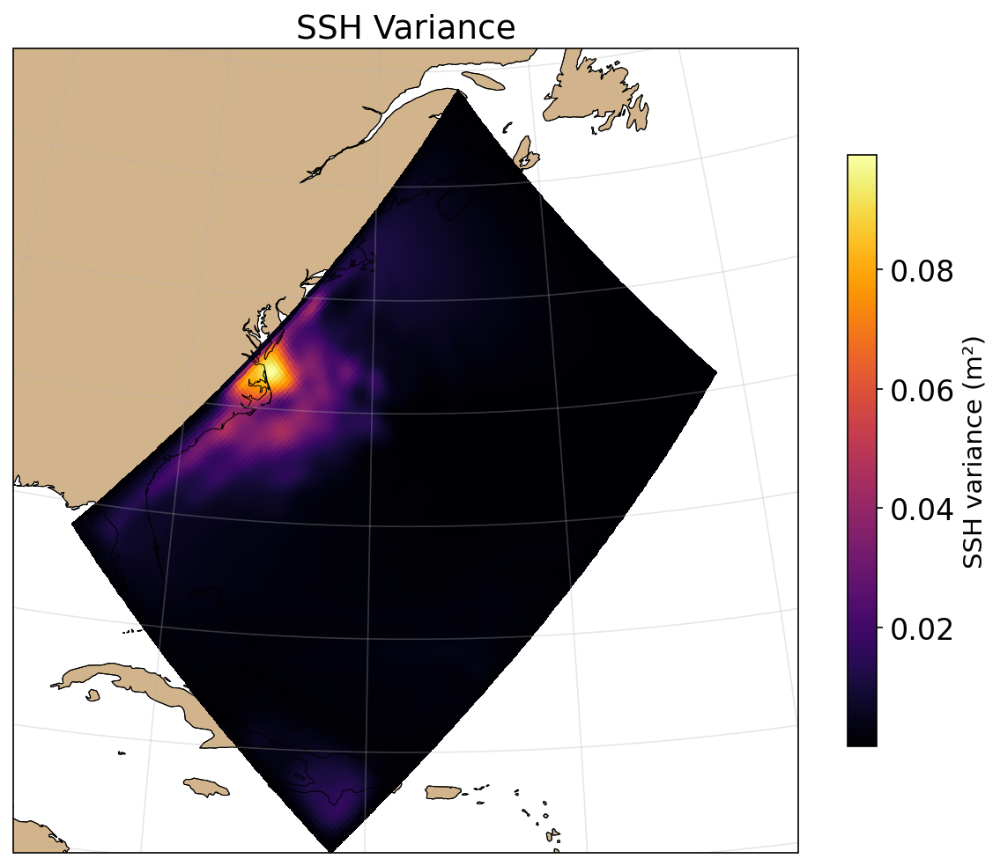
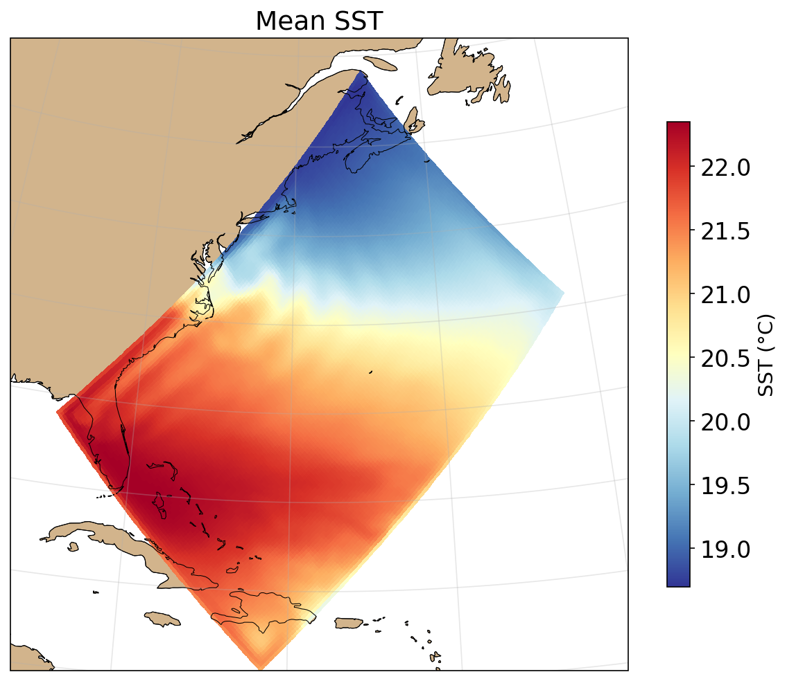
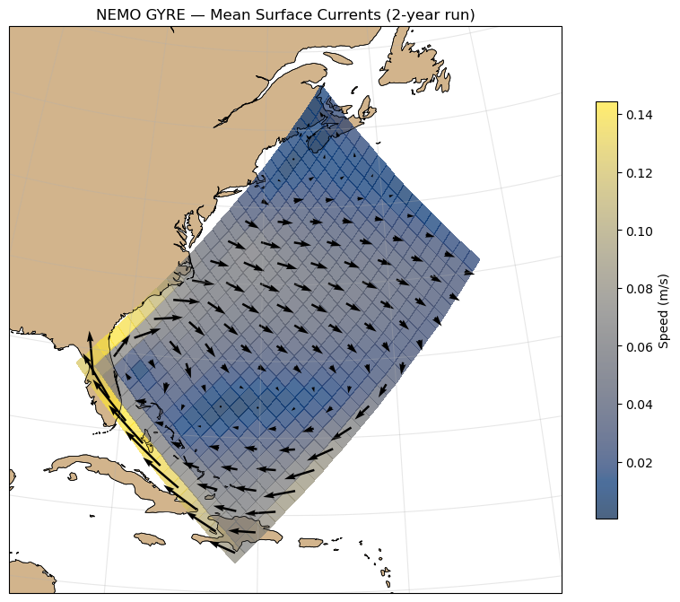
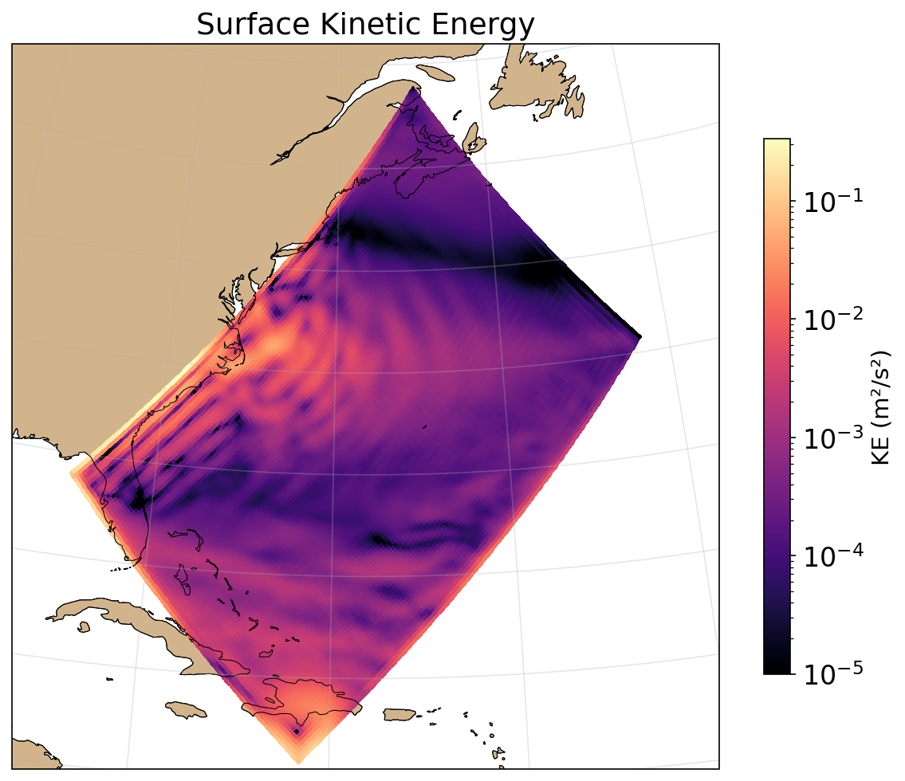
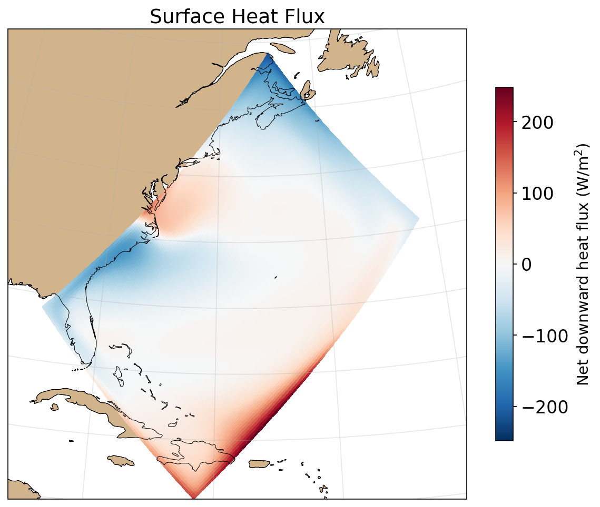
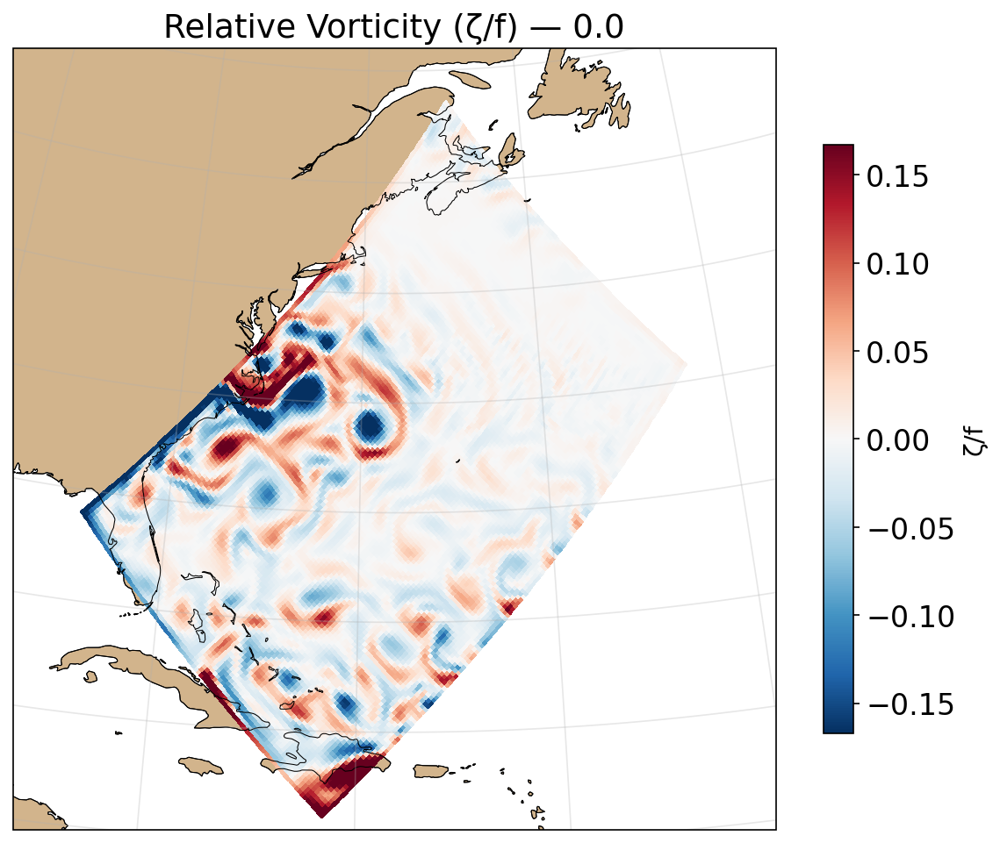
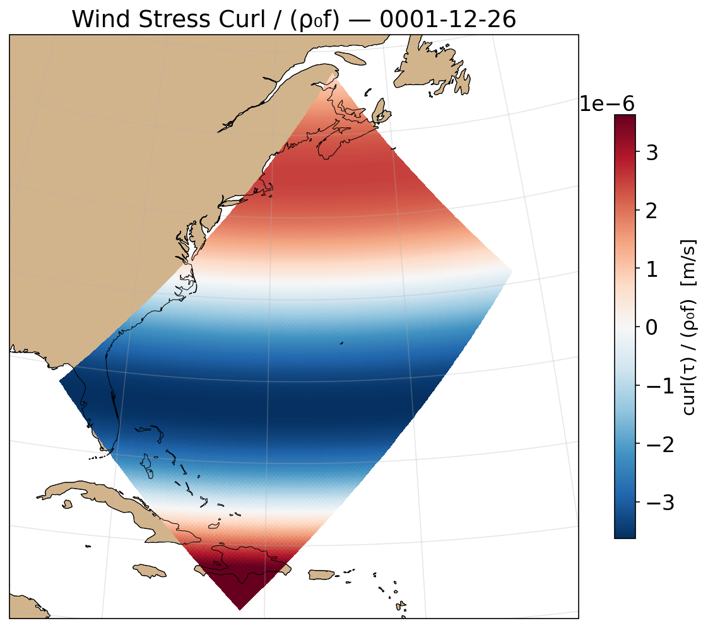
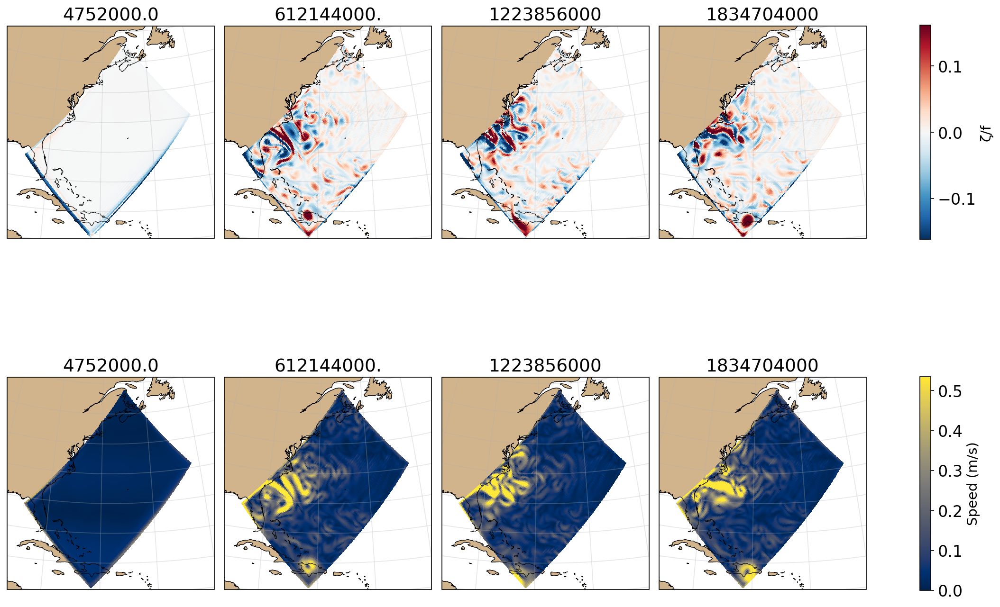

# Claude vs. NEMO

Dockerized [NEMO](https://www.nemo-ocean.eu/) ocean model running the
GYRE configuration — an idealized double-gyre basin on a beta-plane.

| | | |
|:---:|:---:|:---:|
| [](figures/ssh_variance.png) | [](figures/sst_mean.png) | [](figures/surface_currents.png) |
| [ssh.ipynb](analysis/ssh.ipynb) | [sst.ipynb](analysis/sst.ipynb) | [circulation.ipynb](analysis/circulation.ipynb) |
| [](figures/surface_ke.png) | [](figures/heat_flux.png) | [](figures/vorticity.png) |
| [circulation.ipynb](analysis/circulation.ipynb) | [heat_salt.ipynb](analysis/heat_salt.ipynb) | [vorticity.ipynb](analysis/vorticity.ipynb) |
| [](figures/curl_tau.png) | | |
| [vorticity.ipynb](analysis/vorticity.ipynb) | | |

[](figures/eddy_snapshots.png)
[eddies.ipynb](analysis/eddies.ipynb)

## Prerequisites

- Docker
- [Pixi](https://pixi.sh/) (for Python analysis)

## Quick start

```bash
make all        # build → run → analyze
```

### Local (Docker) targets

```bash
make build      # build Docker image (compiles NEMO with gfortran/OpenMPI)
make run        # run simulation (4 MPI ranks), output to output/
make postproc   # rebuild + calendar-fix processor files already in output/
make analyze    # execute analysis notebooks headless, update figures
make slides     # serve docs/slides.html at http://localhost:8000
make push       # cross-build linux/amd64 image and push to GHCR
make clean      # remove output/
```

### HPC (Singularity) workflow

```bash
# 1. Local: push image to GHCR
make push

# 2. NESH: pull image and submit job (see hpc/README.md for full setup)
singularity pull --force nemo-gyre.sif docker://ghcr.io/willirath/2026-claude-nemo:latest
sbatch hpc/job.sh          # full 59-year run; output rebuilt after each 1-yr cycle

# 3. NESH: preliminary look while job is running
OUTPUT_DIR=runs/run_<JOBID> make analyze
```

Override total timesteps or cycle length:
```bash
NEMO_ITEND=32400 sbatch hpc/job.sh              # 3-year test run
NEMO_CYCLE=108000 sbatch hpc/job.sh             # 10-year cycles instead of 1-year
```

## Output

The simulation produces periodically averaged NetCDF files:

- `grid_{T,U,V,W}_*.nc` — temperature, salinity, SSH, velocities
- `mesh_mask.nc` — grid geometry and land/sea mask
- `restart*.nc` — restart files for continuing the run

Analysis notebooks (in [`analysis/`](analysis/)) are executed headless by:

```bash
make analyze
```

- [`ssh.ipynb`](analysis/ssh.ipynb) — SSH variance and time series
- [`sst.ipynb`](analysis/sst.ipynb) — mean SST, temporal evolution, meridional gradient
- [`circulation.ipynb`](analysis/circulation.ipynb) — surface currents and kinetic energy
- [`vorticity.ipynb`](analysis/vorticity.ipynb) — snapshot vorticity (ζ/f) and wind stress curl
- [`eddies.ipynb`](analysis/eddies.ipynb) — multi-panel eddy snapshots
- [`heat_salt.ipynb`](analysis/heat_salt.ipynb) — surface heat flux, heat content, mean salinity
- [`forcing_ke.ipynb`](analysis/forcing_ke.ipynb) — wind stress, total kinetic energy

Open interactively with:

```bash
pixi run jupyter lab
```

## Configuration

Runtime parameters (resolution, timestep, run length, output frequency) live in
[`configs/GYRE_DOCKER/EXPREF/namelist_cfg`](configs/GYRE_DOCKER/EXPREF/namelist_cfg).

- **MPI**: 4 ranks with domain decomposition (rebuild_nemo recombines output)
- **Output**: Periodically averaged NetCDF via IOIPSL (no XIOS dependency)
- **Physics only**: no biogeochemistry (PISCES/TOP disabled)

## Structure

- [`Dockerfile`](Dockerfile) — builds NEMO in Debian bookworm
- [`Makefile`](Makefile) — build/run/analyze pipeline
- [`docker/arch-docker.fcm`](docker/arch-docker.fcm) — compiler/linker settings for Docker
- [`configs/GYRE_DOCKER/`](configs/GYRE_DOCKER/) — NEMO configuration (CPP keys, namelist, source overrides)
- [`analysis/`](analysis/) — Jupyter analysis notebooks
- [`figures/`](figures/) — plot PNGs for README
- `output/` — simulation output (gitignored `*.nc`)
- [`plans/`](plans/) — development milestone notes
- [`nemo/`](nemo/) — NEMO source (git submodule, read-only)

## Setup from scratch

```bash
git clone --recurse-submodules <repo-url>
pixi install
make all
```
